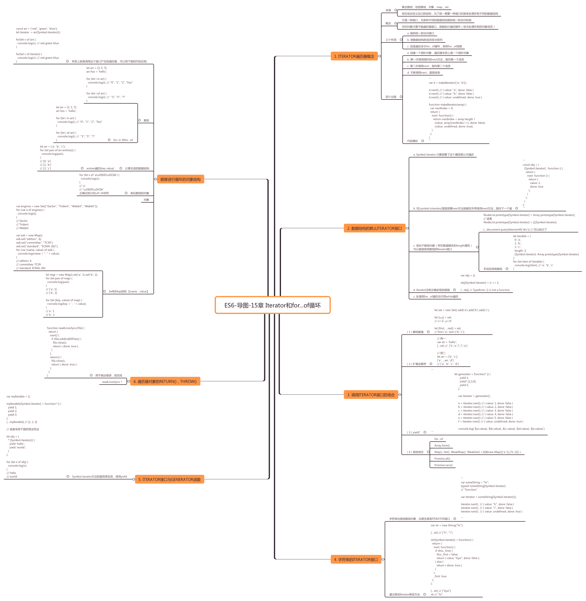

## ES6-导图-15章 Iterator和for...of循环



### 1. Iterator遍历器概念
####  来源

    集合数组，包括数组，对象，map、set
    相互组合定义自己的结构，为了统一需要一种接口机制来处理所有不同的数据结构
    
####  概念
    它是一种接口，为各种不同的数据结构提供统一的访问机制
    任何对象只要不输遍历器接口，就能执行遍历操作（依次处理所有的对象成员）
####  三个作用
    a. 提供统一的访问接口
    b. 使数据结构的成员依次排列
    c. 创造遍历命令for...of循环，即供for...of消费
####  四个过程
    a. 创建一个指针对象，遍历器本质上是一个指针对象
    b. 第一次调用指针的next方法，指向第一个成员
    c. 第二次调用next，指向第二个成员
    d. 不断调用next，直到结束
####    代码模拟

```
var it = makeIterator(['a', 'b']);
it.next() {
    value: "a",
    done: false
}
it.next() {
    value: "b",
    done: false
}
it.next() {
    value: undefined,
    done: true
}
function makeIterator(array) {
    var nextIndex = 0;
    return {
        next: function() {
            return nextIndex < array.length ? {
                value: array[nextIndex++],
                done: false
            }: {
                value: undefined,
                done: true
            };
        }
    };
}

```

### 2. 数据结构的默认Iterator接口
####  a. Symbol.iterator 只要部署了这个属性默认可遍历
####  b. 在[symbol.interator]里面部署next方法就能在外界使用next方法，指向下一个值
  
```
const obj = { [Symbol.iterator] : function() {
        return {
            next: function() {
                return {
                    value: 1,
                    done: true
                };
            }
        };
    }
};
   
```

####  c. 类似于数组对象（存在数值键名和length属性）可以直接使用数组的Iterator接口

```
NodeList.prototype[Symbol.iterator] = Array.prototype[Symbol.iterator];
// 或者NodeList.prototype[Symbol.iterator] = [][Symbol.iterator];
[...document.querySelectorAll('div')]
// 可以执行了


```

手动实现类数组

```
let iterable = {
    0 : 'a',
    1 : 'b',
    2 : 'c',
    length: 3,
    [Symbol.iterator] : Array.prototype[Symbol.iterator]
};
for (let item of iterable) {
    console.log(item); // 'a', 'b', 'c'}
    
```
        
        
####  d. Iterator没有正确实现则报错

```

var obj = {};
obj[Symbol.iterator] = () = >1; [...obj] // TypeError: [] is not a function

```
    
####  c. 处理用for...of遍历也可用while遍历

###3. 调用Iterator接口的场合

####  （1）解构赋值

``` 
 let set = new Set().add('a').add('b').add('c');
let[x, y] = set;
// x='a'; y='b'
let[first, ...rest] = set;
// first='a'; rest=['b','c'];
```
    
####  （2）扩展运算符

```
// 例一
var str = 'hello'; [...str] //  ['h','e','l','l','o']
// 例二
let arr = ['b', 'c']; ['a', ...arr, 'd']
// ['a', 'b', 'c', 'd']

```
    
####  （3）yield*

```
       let generator = function* () {      yield 1;      yield* [2,3,4];      yield 5;    };    var iterator = generator();    a = iterator.next() // { value: 1, done: false }    b = iterator.next() // { value: 2, done: false }    c = iterator.next() // { value: 3, done: false }    d = iterator.next() // { value: 4, done: false }    e = iterator.next() // { value: 5, done: false }    f = iterator.next() // { value: undefined, done: true }       console.log(`${a.value}, ${b.value}, ${c.value}, ${d.value}, ${e.value}`)
       
```
       
####  （4）其他场合

>- for...of
>- Array.from()
>-   Map(), Set(), WeakMap(), WeakSet()（比如new Map([['a',1],['b',2]])）
>-   Promise.all()
>-  Promise.race()
    
### 4. 字符串的Iterator接口
####  字符串也是类数组对象，也原生具有ITERATOR接口

```
var someString = "hi";
typeof someString[Symbol.iterator]
// "function"var iterator = someString[Symbol.iterator]();iterator.next() 
// { value: "h", done: false }iterator.next()  
// { value: "i", done: false }iterator.next()
// { value: undefined, done: true }


```

####  通过修改Iterator修改方法

```

var str = new String("hi"); [...str]
// ["h", "i"]
str[Symbol.iterator] = function() {
    return {
        next: function() {
            if (this._first) {
                this._first = false;
                return {
                    value: "bye",
                    done: false
                };
            } else {
                return {
                    done: true
                };
            }
        },
        _first: true
    };
}; [...str]
// ["bye"]str // "hi"


```
    
    
### 5. Iterator接口与Generator函数

####  Symbol.iterator方法的最简单实现，使用yield

```
var myIterable = {};
myIterable[Symbol.iterator] = function * () {
    yield 1;
    yield 2;
    yield 3;
}; [...myIterable]
// [1, 2, 3]
// 或者采用下面的简洁写法
let obj = { * [Symbol.iterator]() {
        yield 'hello';
        yield 'world';
    }
};
for (let x of obj) {
    console.log(x);
}
// hello
// world

```


### 6. 遍历器对象的return()，throw()
####  用于抛出错误，或完成

```

function readLinesSync(file) {
    return {
        next() {
            if (file.isAtEndOfFile()) {
                file.close();
                return {
                    done: true
                };
            }
        },
        return () {
            file.close();
            return {
                done: true
            };
        },
    };
}

```
 
####  readLinesSync ?
  
#### 能够进行循环的对象结构
  本质上就是调用这个接口产生的遍历器，可以用下面的代码证明。

```
const arr = ['red', 'green', 'blue'];
let iterator = arr[Symbol.iterator]();
for (let v of arr) {
    console.log(v);
    // red green blue}for(let v of iterator) {  console.log(v); 
    // red green blue
}
```
    
####  数组
```
let arr = [3, 5, 7];
arr.foo = 'hello';
for (let i in arr) {
    console.log(i);
    // "0", "1", "2", "foo"
}
for (let i of arr) {
    console.log(i);
    //  "3", "5", "7"
}
//for..in 与for...of
let arr = [3, 5, 7];
arr.foo = 'hello';
for (let i in arr) {
    console.log(i);
    // "0", "1", "2", "foo"
}
for (let i of arr) {
    console.log(i);
    //  "3", "5", "7"
}
``` 
        
        
####  计算生成的数据结构
    entries遍历[key value]
```
let arr = ['a', 'b', 'c'];
for (let pair of arr.entries()) {
    console.log(pair);
}
// [0, 'a']// [1, 'b']// [2, 'c']

```        
####  类似数组的对象

```
for (let x of 'a\uD83D\uDC0A') {
    console.log(x);
}
// 'a'
// '\uD83D\uDC0A'正确识别32位utf-16字符


```
    
#### 对象

####  Set和Map结构 【name，value】

```
var engines = new Set(["Gecko", "Trident", "Webkit", "Webkit"]);
for (var e of engines) {
    console.log(e);
}
// Gecko// Trident
// Webkitvar
es6 = new Map();
es6.set("edition", 6);
es6.set("committee", "TC39");
es6.set("standard", "ECMA-262");
for (var [name, value] of es6) {
    console.log(name + ": " + value);
}
// edition: 6
// committee: TC39
// standard: ECMA-262
let map = new Map().set('a', 1).set('b', 2);
for (let pair of map) {
    console.log(pair);
}
// ['a', 1]
// ['b', 2]
for (let[key, value] of map) {
    console.log(key + ' : ' + value);
}
// a : 1
// b : 2


```